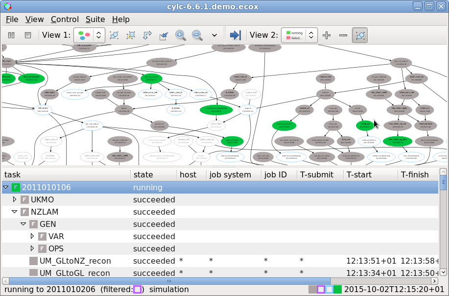

Introduction
============

What Is A Workflow?
-------------------

.. epigraph::

   A workflow consists of an orchestrated and repeatable pattern of business
   activity enabled by the systematic organization of resources into processes
   that transform materials, provide services, or process information.

   -- Wikipedia

In research, business and other fields we may have processes that we repeat
in the course of our work. At its simplest a workflow is a set of steps that
must be followed in a particular order to achieve some end goal.

We can represent each "step" in a workflow as a oval and the order with
arrows.

.. digraph:: bakery
   :align: center

   bgcolor=none
   "purchase ingredients" -> "make dough" -> "bake bread" -> "sell bread"
   "bake bread" -> "clean oven"
   "pre-heat oven" -> "bake bread"

What Is Cylc?
-------------

Cylc (pronounced silk) is a workflow engine, a system that automatically
executes tasks according to their schedules and dependencies.
In a cylc workflow each step is a
computational task, a script to execute. Cylc runs each task as soon as it is
appropriate to do so.

.. minicylc::
   :align: center
   :theme: demo

    a => b => c
    b => d => f
    e => f

Cylc can automatically:

- Submit tasks across computer systems and resource managers.
- Recover from failures.
- Repeat workflows.

Cylc was originally developed at NIWA (The National Institute of Water and
Atmospheric Research - New Zealand) for running their weather forecasting
workflows. Cylc is now developed by an international partnership including
members from NIWA and the Met Office (UK). Though initially developed for
meteorological purposes cylc is a general purpose tool as applicable in
business as in scientific research.

Cylc provides a variety of command line and GUI tools for visualising and
interacting with workflows.

