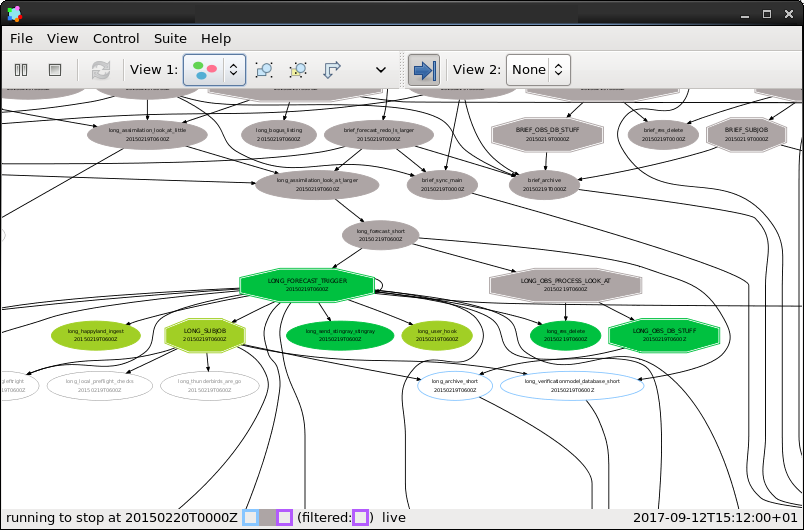
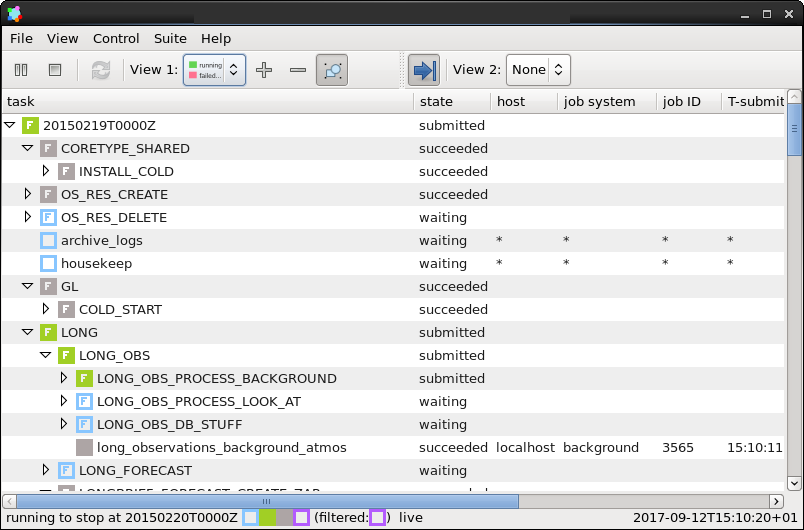
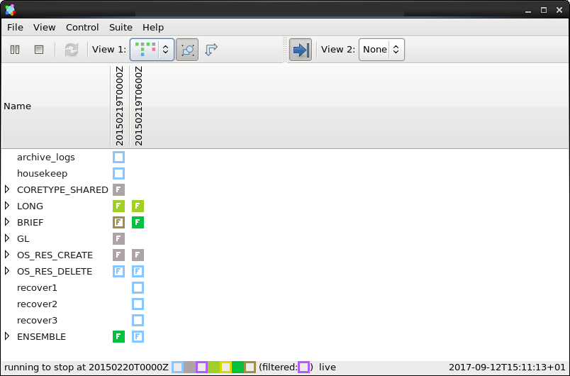

.. include:: ../../../hyperlinks.rst
   :start-line: 1

.. _tutorial-cylc-runtime-introduction:

Introduction
============

.. ifnotslides::

   So far we have been working with the ``[scheduling]`` section. This is where
   the workflow is defined in terms of :term:`tasks <task>` and
   :term:`dependencies <dependency>`.

   In order to make the workflow runnable we must associate tasks with scripts
   or binaries to be executed when the task runs. This means working with the
   ``[runtime]`` section which determines what runs, as well as where and how
   it runs.

.. ifslides::

   ``[scheduling]``
      Defines the workflow in terms of :term:`tasks <task>` and
      :term:`dependencies <dependency>`.
   ``[runtime]``   
      Defines what runs, where and how it runs.

The Task Section
----------------

.. ifnotslides::

   The runtime settings for each task are stored in a sub-section of the
   ``[runtime]`` section. E.g. for a task called ``hello_world`` we would write
   settings inside the following section:

.. code-block:: cylc

   [runtime]
       [[hello_world]]

The ``script`` Setting
----------------------

.. ifnotslides::

   We tell Cylc *what* to execute when a task is run using the ``script``
   setting.

   This setting is interpreted as a bash script. The following example defines a
   task called ``hello_world`` which writes ``Hello World!`` to stdout upon
   execution.

.. code-block:: cylc

   [runtime]
       [[hello_world]]
           script = echo 'Hello World!'

.. note::

   If you do not set the ``script`` for a task then nothing will be run.

We can also call other scripts or executables in this way, e.g:

.. code-block:: cylc

   [runtime]
       [[hello_world]]
           script = ~/foo/bar/baz/hello_world

:envvar:`PATH` and :envvar:`PYTHONPATH`
---------------------------------------

.. ifnotslides::

   It is often a good idea to keep our scripts with the Cylc suite rather than
   leaving them somewhere else on the system.

   If you create a ``bin/`` sub-directory within the :term:`suite directory`
   Cylc will automatically prepend it to the :envvar:`PATH` environment
   variable when the task runs.

.. code-block:: bash
   :caption: bin/hello_world

   #!/usr/bin/bash
   echo 'Hello World!'

.. code-block:: cylc
   :caption: suite.rc

   [runtime]
       [[hello_world]]
           script = hello_world

.. nextslide::

.. ifnotslides::

   Similarly the ``lib/python/`` directory gets prepended to the
   :envvar:`PYTHONPATH` variable.

.. code-block:: python
   :caption: lib/python/hello.py

   def world():
      print('Hello World!')

.. code-block:: cylc
   :caption: suite.rc

   [runtime]
      [[hello_world]]
         script = python -c 'import hello; hello.world()'

.. _tutorial-tasks-and-jobs:

Tasks And Jobs
--------------

.. ifnotslides::

   When a :term:`task` is "Run" it creates a :term:`job`. The job is a bash
   file containing the script you have told the task to run along with
   configuration specifications and a system for trapping errors. It is the
   :term:`job` which actually gets executed and not the task itself. This
   "job file" is called the :term:`job script`.

   During its life a typical :term:`task` goes through the following states:

   Waiting
      :term:`Tasks <task>` wait for their dependencies to be satisfied before
      running. In the meantime they are in the "Waiting" state.
   Submitted
      When a :term:`task's <task>` dependencies have been met it is ready for
      submission. During this phase the :term:`job script` is created.
      The :term:`job` is then submitted to the specified batch system.
      There is more about this in the :ref:`next section
      <tutorial-batch-system>`.
   Running
      A :term:`task` is in the "Running" state as soon as the :term:`job` is
      executed.
   Succeeded
      If the :term:`job` submitted by a :term:`task` has successfully
      completed (i.e. there is zero return code) then it is said to have
      succeeded.

   These descriptions, and a few more (e.g. failed), are called the
   :term:`task states <task state>`.

.. ifslides::

   When a :term:`task` is "Run" it creates a :term:`job`.

   The life-cycle of a job:

   * Waiting
   * Submitted
   * Running
   * Succeeded / Failed

The Cylc GUI
------------

.. ifnotslides::

   To help you to keep track of a running suite Cylc has a graphical user
   interface (the Cylc GUI) which can be used for monitoring and
   interaction.

   The Cylc GUI looks quite like ``cylc graph`` but the tasks are colour-coded
   to represent their state, as in the following diagram.

.. digraph:: example
   :align: center

   Waiting [color="#88c6ff"]
   Running [style="filled" color="#00c410"]
   Succeeded [style="filled" color="#ada5a5"]

.. minicylc::
   :align: center

    a => b => c
    b => d => f
    e => f

.. nextslide::

.. ifnotslides::

   This is the "graph view". The Cylc GUI has two other views called "tree" and
   "dot".

   Screenshot of the Cylc GUI in "Graph View" mode.

.. nextslide::

   Screenshot of the Cylc GUI in "Tree View" mode.

.. nextslide::

   Screenshot of the Cylc GUI in "Dot View" mode.

Where Do All The Files Go?
--------------------------

.. ifnotslides::

   The Work Directory
   ^^^^^^^^^^^^^^^^^^

   When a :term:`task` is run Cylc creates a directory for the :term:`job` to
   run in. This is called the :term:`work directory`.

   By default the work directory is located in a directory structure
   under the relevant :term:`cycle point` and :term:`task` name:

   .. code-block:: sub

      ~/cylc-run/<suite-name>/work/<cycle-point>/<task-name>

   The Job Log Directory
   ^^^^^^^^^^^^^^^^^^^^^

   When a task is run Cylc generates a :term:`job script` which is stored in the
   :term:`job log directory` as the file ``job``.

   When the :term:`job script` is executed the stdout and stderr are redirected
   into the ``job.out`` and ``job.err`` files which are also stored in the
   :term:`job log directory`.

   The :term:`job log directory` lives in a directory structure under the
   :term:`cycle point`, :term:`task` name and :term:`job submission number`:

   .. code-block:: sub

      ~/cylc-run/<suite-name>/log/job/<cycle-point>/<task-name>/<job-submission-num>/

   The :term:`job submission number` starts at 1 and increments by 1 each time
   a task is re-run.

   .. tip::

      If a task has run and is still visible in the Cylc GUI you can view its
      :term:`job log files <job log>` by right-clicking on the task and
      selecting "View".

      .. image:: ../img/cylc-gui-view-log.png
         :align: center
         :scale: 75%

.. ifslides::

   The Work Directory
      .. code-block:: sub

         ~/cylc-run/<suite-name>/work/<cycle-point>/<task-name>
   The Job Log Directory
      .. code-block:: sub

         ~/cylc-run/<suite-name>/log/job/<cycle-point>/<task-name>/<job-submission-num>/

      .. image:: ../img/cylc-gui-view-log.png
         :align: center
         :scale: 75%

Running A Suite
---------------

.. ifnotslides::

   It is a good idea to check a suite for errors before running it.
   Cylc provides a command which automatically checks for any obvious
   configuration issues called ``cylc validate``, run via:

.. code-block:: sub

   cylc validate <path/to/suite>

.. ifnotslides::

   Here ``<path/to/suite>`` is the path to the suite's location within the
   filesystem (so if we create a suite in ``~/cylc-run/foo`` we would put
   ``~/cylc-run/foo/suite.rc``).

   Next we can run the suite using the ``cylc run`` command.

.. code-block:: sub

   cylc run <name>

.. ifnotslides::

   The ``name`` is the name of the :term:`suite directory` (i.e. ``<name>``
   would be ``foo`` in the above example).

.. note::

   In this tutorial we are writing our suites in the ``cylc-run`` directory.

   It is possible to write them elsewhere on the system. If we do so we
   must register the suite with Cylc before use.

   We do this using the ``cylc reg`` command which we supply with a name which
   will be used to refer to the suite in place of the path i.e:

   .. code-block:: sub

      cylc reg <name> <path/to/suite>
      cylc validate <name>
      cylc run <name>

   The ``cylc reg`` command will create a directory for the suite in the
   ``cylc-run`` directory meaning that we will have separate
   :term:`suite directories <suite directory>` and
   :term:`run directories <run directory>`.

Suite Files
-----------

.. ifnotslides::

   Cylc generates files and directories when it runs a suite, namely:

   ``log/``
      Directory containing log files, including:

      ``log/db``
         The database which Cylc uses to record the state of the suite;
      ``log/job``
         The directory where the :term:`job log files <job log>` live;
      ``log/suite``
         The directory where the :term:`suite log files <suite log>` live.
         These files are written by Cylc as the suite is run and are useful for
         debugging purposes in the event of error.

   ``suite.rc.processed``
      A copy of the ``suite.rc`` file made after any `Jinja2`_ has been
      processed - we will cover this in the
      :ref:`tutorial-cylc-consolidating-configuration` section.
   ``share/``
      The :term:`share directory` is a place where :term:`tasks <task>` can
      write files which are intended to be shared within that cycle.
   ``work/``
      A directory hierarchy containing task's :term:`work directories
      <work directory>`.

.. ifslides::

   * ``log/``
      * ``log/db``
      * ``log/job``
      * ``log/suite``
   * ``suite.rc.processed``
   * ``share/``
   * ``work/``

   .. nextslide::

   .. rubric:: In this practical we will add some scripts to, and run, the
      :ref:`weather forecasting suite <tutorial-datetime-cycling-practical>`
      from the :ref:`scheduling tutorial <tutorial-scheduling>`.

   Next section: :ref:`tutorial-cylc-runtime-configuration`

.. practical::

   .. rubric:: In this practical we will add some scripts to, and run, the
      :ref:`weather forecasting suite <tutorial-datetime-cycling-practical>`
      from the :ref:`scheduling tutorial <tutorial-scheduling>`.

   #. **Create A New Suite.**

      The following command will copy some files for us to work with into
      a new suite called ``runtime-introduction``:

      .. code-block:: bash

         rose tutorial runtime-introduction
         cd ~/cylc-run/runtime-introduction

      In this directory we have the ``suite.rc`` file from the
      :ref:`weather forecasting suite <tutorial-datetime-cycling-practical>`
      with some runtime configuration added to it.

      There is also a script called ``get-observations`` located in the bin
      directory.

      Take a look at the ``[runtime]`` section in the ``suite.rc`` file.

   #. **Run The Suite.**

      First validate the suite by running:

      .. code-block:: bash

         cylc validate .

      Open the Cylc GUI (in the background) by running the following command:

      .. code-block:: bash

         cylc gui runtime-introduction &

      Finally run the suite by executing:

      .. code-block:: bash

         cylc run runtime-introduction

      The tasks will start to run - you should see them going through the
      "Waiting", "Running" and "Succeeded" states.

      When the suite reaches the final cycle point and all tasks have succeeded
      it will shutdown automatically and the GUI will go blank.

      .. tip::

         You can also run a suite from the Cylc GUI by pressing the "play"
         button.

         .. image:: ../img/gcylc-play.png
            :align: center

         A box will appear. Ensure that "Cold Start" is selected then press
         "Start".

         .. image:: ../img/cylc-gui-suite-start.png
            :align: center

   #. **Inspect A Job Log.**

      Try opening the file ``job.out`` for one of the
      ``get_observations`` jobs in a text editor. The file will be
      located within the :term:`job log directory`:

      .. code-block:: sub

         log/job/<cycle-point>/get_observations_heathrow/01/job.out

      You should see something like this:

      .. code-block:: none

         Suite    : runtime-introduction
         Task Job : 20000101T0000Z/get_observations_heathrow/01 (try 1)
         User@Host: username@hostname

         Guessing Weather Conditions
         Writing Out Wind Data
         1970-01-01T00:00:00Z NORMAL - started
         2038-01-19T03:14:08Z NORMAL - succeeded

      * The first three lines are information which Cylc has written to the file
        to provide information about the job.
      * The last two lines were also written by cylc. They provide timestamps
        marking the stages in the job's life.
      * The lines in the middle are the stdout of the job itself.

   #. **Inspect A Work Directory.**

      The ``get_rainfall`` task should create a file called ``rainfall`` in its
      :term:`work directory`. Try opening this file, recalling that the
      format of the relevant path from within the work directory will be:

      .. code-block:: sub

         work/<cycle-point>/get_rainfall/rainfall

      .. hint::

         The ``get_rainfall`` task only runs every third cycle.

   #. **Extension: Explore The Cylc GUI**

      * Try re-running the suite.

      * Try changing the current view(s).

        .. tip::

           You can do this from the "View" menu or from the toolbar:

           .. image:: ../img/cylc-gui-view-selector.png
              :align: center
              :scale: 75%

      * Try pressing the "Pause" button which is found in the top left-hand
        corner of the GUI.

      * Try right-clicking on a task. From the right-click menu you could try:

        * "Trigger (run now)"
        * "Reset State"
