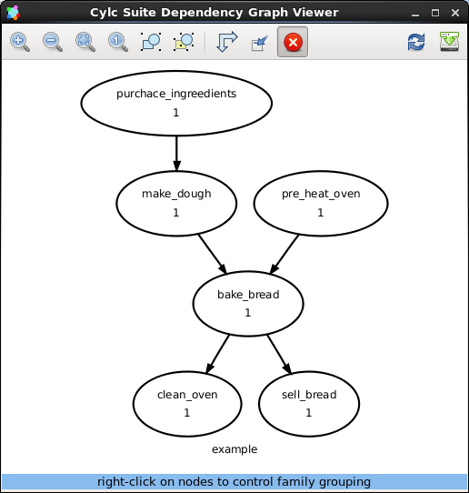

.. include:: ../../../hyperlinks.rst

.. _tutorial-cylc-graphing:

Graphing
========

In this section we will cover writing basic workflows in cylc.

.. _Cylc file format:

The ``suite.rc`` File Format
----------------------------

.. ifnotslides::

   We refer to a Cylc workflow as a :term:`Cylc suite`. A Cylc suite is a
   directory containing a ``suite.rc`` file. This configuration file is where
   we define our workflow. The ``suite.rc`` file uses a nested `INI`_-based
   format:

.. ifslides::

   * Cylc workflow == Cylc suite
   * Cylc suite is a directory containing a ``suite.rc`` file
   * The ``suite.rc`` file is written in a nested `INI`_-based format

.. ifnotslides::

   * Comments start with a ``#`` character.
   * Settings are written as ``key = value`` pairs.
   * Settings can be contained within sections.
   * Sections are written inside square brackets i.e. ``[section-name]``.
   * Sections can be nested, by adding an extra square bracket with each level,
     so a sub-section would be written ``[[sub-section]]``, a sub-sub-section
     ``[[[sub-sub-section]]]``, and so on.

Example
^^^^^^^

.. code-block:: cylc

   # Comment
   [section]
       key = value
       [[sub-section]]
           another-key = another-value  # Inline comment
           yet-another-key = """
               A
               Multi-line
               String
           """

Shorthand
^^^^^^^^^

Throughout this tutorial we will refer to settings in the following format:

``[section]``
   Refers to the entire section.
``[section]key``
   Refers to a setting within the section.
``[section]key=value``
   Expresses the value of the setting.
``[section][sub-section]another-key``
   Note we only use one set of square brackets with nested sections.

Duplicate Items
^^^^^^^^^^^^^^^

Duplicate sections get merged:

.. list-table::
   :class: grid-table

   * -
      .. code-block:: cylc
         :caption: input

         [a]
            c = C
         [b]
            d = D
         [a]  # duplicate
            e = E

     -
      .. code-block:: cylc
         :caption: result

         [a]
            c = C
            e = E
         [b]
            d = D

.. nextslide::

Duplicate settings get overwritten:

.. list-table::
   :class: grid-table

   * -
      .. code-block:: cylc
         :caption: input

         a = foo
         a = bar  # duplicate

     -
      .. code-block:: cylc
         :caption: result

         a = bar

Indentation
^^^^^^^^^^^

It is advisable to indent ``suite.rc`` files.

However, Cylc ignores this indentation meaning the following two examples
are equivalent:

.. list-table::
   :class: grid-table

   * - 
       .. code-block:: cylc
          :caption: input

          [section]
              a = A
              [[sub-section]]
                  b = B
              b = C
              # this setting is still
              # in [[sub-section]]

     - 
       .. code-block:: cylc
          :caption: result

          [section]
              a = A
              [[sub-section]]
                  b = C

Graph Strings
-------------

In Cylc we consider workflows in terms of :term:`tasks <task>` and
:term:`dependencies <dependency>`.

.. ifnotslides::

   Task are represented as words and dependencies as arrows (``=>``), so the
   following text defines two tasks where ``make_dough`` is dependent on
   ``purchase_ingredients``:

.. minicylc::
   :align: center
   :snippet:
   :theme: demo

   purchase_ingredients => make_dough

.. nextslide::

.. ifnotslides::

   In a Cylc workflow this would mean that ``make_dough`` would only run when
   ``purchase_ingredients`` has succeeded. These :term:`dependencies
   <dependency>` can be chained together:

.. minicylc::
   :align: center
   :snippet:
   :theme: demo

   purchase_ingredients => make_dough => bake_bread => sell_bread

.. nextslide::

.. ifnotslides::

   This line of text is referred to as a :term:`graph string`. These graph
   strings can be combined to form more complex workflows:

.. minicylc::
   :align: center
   :snippet:
   :theme: demo

   purchase_ingredients => make_dough => bake_bread => sell_bread
   pre_heat_oven => bake_bread
   bake_bread => clean_oven

.. nextslide::

.. ifnotslides::

   Graph strings can also contain "and" (``&``) and "or" (``|``) operators, for
   instance the following lines are equivalent to the ones just above:

.. code-block:: cylc-graph

   purchase_ingredients => make_dough
   pre_heat_oven & make_dough => bake_bread => sell_bread & clean_oven

.. nextslide::

Collectively these :term:`graph strings<graph string>` are referred to as a
:term:`graph`.

.. admonition:: Note
   :class: tip

   .. ifnotslides::

      The order in which lines appear in the graph section doesn't matter, for
      instance the following examples are the same as each other:

   .. code-block:: cylc-graph

      foo => bar
      bar => baz

   .. code-block:: cylc-graph

      bar => baz
      foo => bar

Cylc Graphs
-----------

.. ifnotslides::

   In a :term:`Cylc suite` the :term:`graph` is stored under the
   ``[scheduling][dependencies]graph`` setting, i.e:

.. code-block:: cylc

   [scheduling]
       [[dependencies]]
           graph = """
               purchase_ingredients => make_dough
               pre_heat_oven & make_dough => bake_bread => sell_bread & clean_oven
           """

.. nextslide::

.. ifnotslides::

   This is a minimal :term:`Cylc suite`, in which we have defined a
   :term:`graph` representing a workflow for Cylc to run.
   We have not yet provided Cylc with the scripts or binaries to run for
   each task. This will be covered later in the
   :ref:`runtime tutorial <tutorial-runtime>`.

   Cylc provides a GUI for visualising :term:`graphs <graph>`. It is run on the
   command line using the ``cylc graph <path>`` command where the path ``path``
   is to the ``suite.rc`` file you wish to visualise.

   When run, ``cylc graph`` will display a diagram similar to the ones you have
   seen so far. The number ``1`` which appears below each task is the
   :term:`cycle point`. We will explain what this means in the next section.

.. nextslide::

.. hint::

   .. ifnotslides::

      A graph can be drawn in multiple ways, for instance the following two
      examples are equivalent:

   .. ifslides::

      A graph can be drawn in multiple ways:

   .. image:: ../img/cylc-graph-reversible.svg
      :align: center

   .. ifnotslides::

      The graph drawn by ``cylc graph`` may vary slightly from one run to
      another but the tasks and dependencies will always be the same.

.. nextslide::

.. ifslides::

   .. rubric:: In this practical we will create a new Cylc suite and write a
      graph for it to use.

   Next session: :ref:`tutorial-integer-cycling`

.. practical::

   .. rubric:: In this practical we will create a new Cylc suite and write a
      graph for it to use.

   #. **Create a Cylc suite.**

      A Cylc suite is just a directory containing a ``suite.rc`` file.

      If you don't have one already, create a ``cylc-run`` directory in your
      user space i.e::

         ~/cylc-run

      Within this directory create a new folder called ``graph-introduction``,
      which is to be our :term:`suite directory`. Move into it:

      .. code-block:: bash

         mkdir ~/cylc-run/graph-introduction
         cd ~/cylc-run/graph-introduction

      Inside this directory create a ``suite.rc`` file and paste in the
      following text:

      .. code-block:: cylc

         [scheduling]
             [[dependencies]]
                 graph = """
                     # Write graph strings here!
                 """

   #. **Write a graph.**

      We now have a blank Cylc suite, next we need to define a workflow.

      Edit your ``suite.rc`` file to add graph strings representing the
      following graph:

      .. digraph:: graph_tutorial
         :align: center

         foo -> bar -> baz -> qux
         pub -> bar -> wop

   #. **Use** ``cylc graph`` **to visualise the workflow.**

      Once you have written some graph strings try using ``cylc graph`` to
      display the workflow. Run the following command:

      .. code-block:: bash

         cylc graph .

      .. admonition:: Note
         :class: hint

         ``cylc graph`` takes the path to the suite as an argument. As we are
         inside the :term:`suite directory` we can run ``cylc graph .``.

      If the results don't match the diagram above try going back to the
      suite.rc file and making changes.

      .. tip::

         In the top right-hand corner of the ``cylc graph`` window there is a
         refresh button which will reload the GUI with any changes you have
         made.

         .. image:: ../img/cylc-graph-refresh.png
            :align: center

      .. spoiler:: Solution warning

         There are multiple correct ways to write this graph. So long as what
         you see in ``cylc graph`` matches the above diagram then you have a
         correct solution.

         Two valid examples:

         .. code-block:: cylc-graph

            foo & pub => bar => baz & wop
            baz => qux

         .. code-block:: cylc-graph

            foo => bar => baz => qux
            pub => bar => wop

         The whole suite should look something like this:

         .. code-block:: cylc

            [scheduling]
                [[dependencies]]
                    graph = """
                        foo & pub => bar => baz & wop
                        baz => qux
                    """
