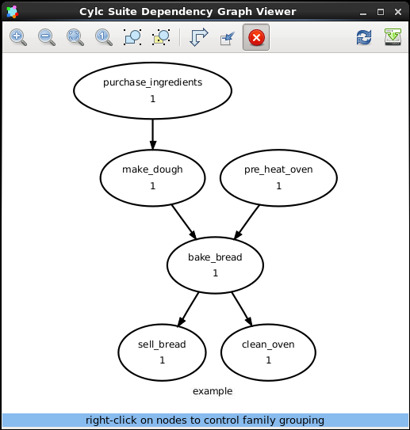

.. _ini-format: https://en.wikipedia.org/wiki/INI_file

Graphing
========

In this section we will cover writing basic workflows in cylc.

The suite.rc File Format
------------------------

We refer to a cylc workflow as a :term:`cylc suite`. A cylc suite is a directory
containing a ``suite.rc`` file. This configuration file is where
we define our workflow. The ``suite.rc`` file uses a nested
`INI <ini-format>`_-based format:

* Comments start with a ``#`` character.
* Settings are written as ``key = value`` pairs.
* Settings can be contained within sections, sections are written inside square
  brackets i.e. ``[section-name]``.
* Sections can be nested, we add an extra square bracket with each level, so a
  sub section would be written ``[[sub-section]]`` a sub-sub-section
  ``[[[sub-sub-section]]]`` and so on.

.. code-block:: cylc

   # Comment
   [section]
       key = value
       [[sub-section]]
           another-key = another-value  # Inline comment.
           yet-another-key = """
   A
   Multi-line
   String
   """

Throughout this tutorial we will refer to settings in the following format:

* ``[section]`` - Refers to the entire section.
* ``[section]key`` - Refers to a setting within the section.
* ``[section]key=value`` - Expresses the value of the setting.
* ``[section][sub-section]another-key`` - We only use one set of square
  brackets with nested sections.

.. tip::

   It is advisable to indent ``suite.rc`` files, this indentation, however,
   is ignored when the file is parsed so settings must appear before
   sub-sections.

   .. code-block:: cylc

      [section]
          key = value  # This setting belongs to the section.
          [[sub-section]]
              key = value  # This setting belongs to the sub-section.

          # This setting belongs to the sub-section as indentation is ignored.
          # Always write settings before defining any sub-sections!
          key = value

.. note::

   In the ``suite.rc`` file format duplicate sections are additive, that is to
   say the following two examples are equivalent:

   .. code-block:: cylc

      [a]
         c = C
      [b]
         d = D
      [a]
         e = E

   .. code-block:: cylc

      [a]
         c = C
         e = E
      [b]
         d = D

   Settings, however, are not additive meaning that a duplicate setting will
   override an earlier value. The following two examples are equivalent:

   .. code-block:: cylc

      a = foo
      a = bar

   .. code-block:: cylc

      a = bar

Graph Strings
-------------

In cylc we consider workflows in terms of :term:`tasks <task>` and
:term:`dependencies <dependency>`. Task are
represented as words and dependencies as arrows (``=>``), so the following text
defines two tasks where ``make_dough`` is dependent on ``purchase_ingredients``:

.. minicylc::
   :align: center
   :snippet:
   :theme: demo

   purchase_ingredients => make_dough

In a cylc workflow this would mean that ``make_dough`` would only run once
``purchase_ingredients`` has succeeded. These :term:`dependencies <dependency>`
can be chained together:

.. minicylc::
   :align: center
   :snippet:
   :theme: demo

   purchase_ingredients => make_dough => bake_bread => sell_bread

This line of text is referred to as a :term:`graph string`. These graph strings
can be combined to form more complex workflows:

.. minicylc::
   :align: center
   :snippet:
   :theme: demo

   purchase_ingredients => make_dough => bake_bread => sell_bread
   pre_heat_oven => bake_bread
   bake_bread => clean_oven

Graph strings can also contain "and" (``&``) and "or" (``|``) operators, for
instance the following lines are equivalent to the previous ones:

.. code-block:: cylc-graph

   purchase_ingredients => make_dough
   pre_heat_oven & make_dough => bake_bread => sell_bread & clean_oven

Collectively these :term:`graph strings<graph string>` are referred to as a
:term:`graph`.

.. note::

   The order in which lines appear in the graph section doesn't matter, for
   instance:

   .. code-block:: cylc-graph

      foo => bar
      bar => baz

   Is the same as:

   .. code-block:: cylc-graph

      bar => baz
      foo => bar

Cylc Graphs
-----------

In a :term:`cylc suite` the :term:`graph` is stored under the
``[scheduling][dependencies]graph`` setting, i.e:

.. code-block:: cylc

   [scheduling]
       [[dependencies]]
           graph = """
               purchase_ingredients => make_dough
               pre_heat_oven & make_dough => bake_bread => sell_bread & clean_oven
           """

This is a minimal :term:`cylc suite`, in which we have defined a :term:`graph`
representing a workflow for cylc to run.
We have not yet provided cylc with the scripts or binaries to run for
each task, we will cover this later in the
:ref:`runtime tutorial <tutorial-runtime>`.

Cylc provides a GUI for visualising :term:`graphs<graph>`, it is run on the
command line using the ``cylc graph <path>`` command where the path ``path``
is to the suite.rc file you wish to visualise.

When run, ``cylc graph`` will display a diagram similar to the ones you have
seen so far. The number "1" which appears bellow each task is the
:term:`cycle point`, we will explain what this means in the next section.

.. practical::

   .. rubric:: In this practical we will create a new cylc suite and write a
      graph for it to use.

   #. **Create a cylc suite.**

      A cylc suite is just a directory containing a ``suite.rc`` file.

      If you don't have one already create a ``cylc-run`` directory in your
      user space i.e::

         ~/cylc-run

      Within this directory create a new folder called ``graph-introduction``,
      this is to be our :term:`suite directory`. Move into it:

      .. code-block:: bash

         mkdir ~/cylc-run/graph-introduction
         cd ~/cylc-run/graph-introduction

      Inside this directory create a ``suite.rc`` file and paste in the
      following text:

      .. code-block:: cylc

         [scheduling]
             [[dependencies]]
                 graph = """
                     # Write graph strings here!
                 """

   #. **Write a graph.**

      We now have a blank cylc suite, next we need to define a workflow.

      Edit your ``suite.rc`` file to add graph strings representing the
      following graph:

      .. digraph:: graph_tutorial
         :align: center

         bgcolor=none

         foo -> bar -> baz -> qux
         pub -> bar -> wop

   #. **Use ``cylc-graph`` to visualise the workflow.**

      Once you have written some graph strings try using ``cylc graph`` to
      display the workflow. Run the following command:

      .. code-block:: bash

         cylc graph .

      .. note::

         ``cylc graph`` takes the path to the suite as an argument. As we are
         inside the :term:`suite directory` we can run ``cylc graph .``.

      If the results don't match the diagram above try going back to the
      suite.rc file and making changes.

      .. tip::

         In the top right-hand corner of the ``cylc graph`` window there is a
         refresh button which will reload the GUI with any changes you have
         made.

         .. image:: ../img/cylc-graph-refresh.png
            :align: center

      .. spoiler:: Solution warning

         There are multiple correct ways to write this graph. So long as what
         you see in ``cylc graph`` matches the above diagram then you have a
         correct solution.

         Two valid examples:

         .. code-block:: cylc-graph

            foo & pub => bar => baz & wop
            baz => qux

         .. code-block:: cylc-graph

            foo => bar => baz => qux
            pub => bar => wop

         The whole suite should look something like this:

         .. code-block:: cylc

            [scheduling]
                [[dependencies]]
                    graph = """
                        foo & pub => bar => baz & wop
                        baz => qux
                    """
