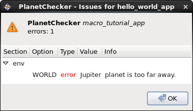
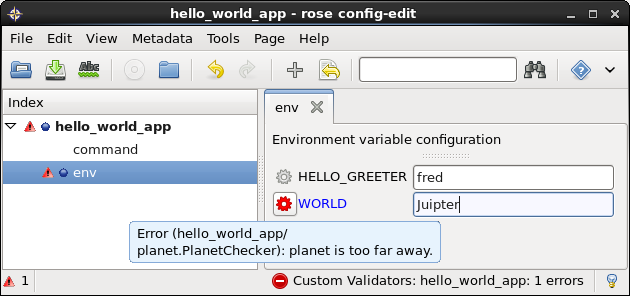

.. _macro-dev:

Custom Macros
=============

Rose macros are custom python modules which can perform checking
beyond that which (e.g. ``type``, ``range``, ``warn-if``, etc)
can provide.

This tutorial covers the development of checking (**validator**),
changing (**transformer**) and reporting (**reporter**) macros.

Warning
-------

Macros should **only** be written if there is a genuine need that is not
covered by :ref:`other metadata <metadata values>` - make sure you are
familiar with :ref:`conf-meta` before you write your own (real-life)
macros.

For example, ``fail-if`` and ``warn-if`` metadata options can perform
complex inter-setting validation. See the
:ref:`tutorial <tutorial-rose-fail-if-warn-if>` for details.

Purpose
-------

Macros are used in Rose to report problems with a configuration,
and to change it. Nearly all metadata mechanics (checking vs metadata
settings, and changing - e.g. ``trigger``) are performed within Rose
by the Rose built-in macros.

Custom macros are user-defined, but follow exactly the same API - they
are just in a different filespace location. They can be invoked via
the command line (:ref:`command-rose-macro`) or from within the
:menuselection:`Metadata` menu in the config editor.

Example
-------

For these examples we will create an example app called
``macro_tutorial_app`` that could be part of a typical suite.

Create a directory for your suite app called ``macro_tutorial_app``::

   mkdir -p ~/rose-tutorial/macro_tutorial_app

Inside the ``macro_tutorial_app`` directory, create a :rose:file:`rose-app.conf`
file and paste in the following contents:

.. code-block:: rose

   [command]
   default=echo "Hello $WORLD!"

   [env]
   WORLD=Earth

The metadata for the app lives under the ``meta/`` sub directory.
Our new macro will live with the metadata.

For this example, we want to check the value of the option
``env=WORLD`` in our ``macro_tutorial_app`` application. Specifically,
for this example, we want our macro to give us an error if the 'world'
is too far away from Earth.

Create the directories ``meta/lib/python/macros/`` by running::

   mkdir -p meta/lib/python/macros

Create an empty file called :rose:file:`rose-meta.conf` in the directory::

   touch meta/rose-meta.conf

Create an empty file called ``__init__.py`` in the directory::

   touch meta/lib/python/macros/__init__.py

Finally, create a file called ``planet.py`` in the directory::

   touch meta/lib/python/macros/planet.py

Validator Macro
^^^^^^^^^^^^^^^

Open ``planet.py`` in a text editor and paste in the following code:

.. code-block:: python

   #!/usr/bin/env python
   # -*- coding: utf-8 -*-

   import re
   import subprocess

   import rose.macro

   class PlanetChecker(rose.macro.MacroBase):

       """Checks option values that refer to planets."""

       opts_to_check = [("env", "WORLD")]

       def validate(self, config, meta_config=None):
           """Return a list of errors, if any."""
           for section, option in self.opts_to_check:
               node = config.get([section, option])
               if node is None or node.is_ignored():
                   continue
               # Check the option value (node.value) here
           return self.reports

This is the bare bones of a Rose macro - a bit of Python that is a
subclass of :py:class:`rose.macro.MacroBase`. At the moment, it doesn't
do anything.

We need to check the value of the option (``env=WORLD``) in our
app configuration. To do this, we'll generate a list of allowed
'planet' choices that aren't too far away from Earth at the moment.

Call a method to get the choices by adding the line:

.. code-block:: python

   allowed_planets = self._get_allowed_planets()

at the top of the ``validate`` method, so it looks like this:

.. code-block:: python

   def validate(self, config, meta_config=None):
       """Return a list of errors, if any."""
       allowed_planets = self._get_allowed_planets()

Now add the method ``_get_allowed_planets`` to the class:

.. code-block:: python

   def _get_allowed_planets(self):
       # Retrieve planets less than a certain distance away.
       cmd_strings = ["curl", "-s",
                      "http://www.heavens-above.com/planetsummary.aspx"]
       p = subprocess.Popen(cmd_strings, stdout=subprocess.PIPE)
       text = p.communicate()[0]
       planets = re.findall("(\w+)</td>",
                            re.sub('(?s)^.*(tablehead.*?ascension).*$',
                                   r"\1", text))
       distances = re.findall("([\d.]+)</td>",
                              re.sub('(?s)^.*(Range.*?Brightness).*$',
                                     r"\1", text))
       for planet, distance in zip(planets, distances):
           if float(distance) > 5.0:
               # The planet is more than 5 AU away.
               planets.remove(planet)
       planets += ["Earth"]  # Distance ~ 0
       return planets

This will give us a list of valid (nearby) solar system planets which
our configuration option should be in. If it isn't, we need to send a
message explaining the problem. Add:

.. code-block:: python

   error_text = "planet is too far away."

at the top of the class, like this:

.. code-block:: python

   class PlanetChecker(rose.macro.MacroBase):

       """Checks option values that refer to planets."""

       error_text = "planet is too far away."
       opts_to_check = [("env", "WORLD")]

       def validate(self, config, meta_config=None):
           """Return a list of errors, if any."""
           allowed_planets = self._get_allowed_planets()

Finally, we need to check if the configuration option is in the list,
by replacing

.. code-block:: python

   # Check the option value (node.value) here

with:

.. code-block:: python

   if node.value not in allowed_planets:
       self.add_report(section, option, node.value, self.error_text)

The ``self.add_report`` call is invoked when the planet choice the
user has made is not in the allowed planets. It adds the error
information about the section and option (``env`` and ``WORLD``)
to the ``self.reports`` list, which is returned to the rest of
Rose to see if the macro reports any problems.

Your final macro should look like this:

.. code-block:: python

   #!/usr/bin/env python
   # -*- coding: utf-8 -*-

   import re
   import subprocess

   import rose.macro

   class PlanetChecker(rose.macro.MacroBase):

       """Checks option values that refer to planets."""

       error_text = "planet is too far away."
       opts_to_check = [("env", "WORLD")]

       def validate(self, config, meta_config=None):
           """Return a list of errors, if any."""
           allowed_planets = self._get_allowed_planets()
           for section, option in self.opts_to_check:
               node = config.get([section, option])
               if node is None or node.is_ignored():
                   continue
               if node.value not in allowed_planets:
                   self.add_report(section, option, node.value, self.error_text)
           return self.reports

       def _get_allowed_planets(self):
           # Retrieve planets less than a certain distance away.
           cmd_strings = ["curl", "-s",
                          "http://www.heavens-above.com/planetsummary.aspx"]
           p = subprocess.Popen(cmd_strings, stdout=subprocess.PIPE)
           text = p.communicate()[0]
           planets = re.findall("(\w+)</td>",
                                re.sub(r'(?s)^.*(<thead.*?ascension).*$',
                                       r"\1", text))
           distances = re.findall("([\d.]+)</td>",
                                  re.sub('(?s)^.*(Range.*?Brightness).*$',
                                         r"\1", text))
           for planet, distance in zip(planets, distances):
               if float(distance) > 5.0:
                   # The planet is more than 5 AU away.
                   planets.remove(planet)
           planets += ["Earth"]  # Distance ~ 0
           return planets

Results
"""""""

Your validator macro is now ready to use.

Run the config editor with the command::

   rose edit

in the application directory. Navigate to the ``env`` page, and
change the option ``env=WORLD`` to ``Jupiter``.

To run the macro, select the menu
:menuselection:`Metadata --> macro_tutorial_app -->
planet.PlanetChecker.validate`.

It should either return an "OK" dialog, or give an error dialog
like the one below depending on the current Earth-Jupiter distance.

If there is an error, the variable should display an error icon on
the ``env`` page, which you can hover-over to get the error text as in
the screenshot below. You can remove the error by fixing the value and
re-running your macro.

Try changing the value of ``env=WORLD`` to other solar system planets
and re-running the macro.

You can also run your macro from the command line::

   rose macro planet.PlanetChecker

Transformer Macro
^^^^^^^^^^^^^^^^^

We'll now make a macro that changes the configuration. Our example
will change the value of ``env=WORLD`` to something else.

Open ``planet.py`` in a text editor and append the following code:

.. code-block:: python

   class PlanetChanger(rose.macro.MacroBase):

       """Switch between planets."""

       change_text = '{0} to {1}'
       opts_to_change = [("env", "WORLD")]
       planets = ["Mercury", "Venus", "Earth", "Mars", "Jupiter", "Saturn",
                   "Uranus", "Neptune", "Eris"]

       def transform(self, config, meta_config=None):
           """Transform configuration and return it with a list of changes."""
           for section, option in self.opts_to_change:
               node = config.get([section, option])
               # Do something to the configuration.
           return config, self.reports

This is another bare-bones macro class, although this time it supplies
a ``transform`` method instead of a ``validate`` method.

You can see that it returns a configuration object (``config``) as well
as ``self.reports``. This means that you can modify the configuration
e.g. by adding or deleting a variable and then returning the changed
config object.

We need to add some code to make some changes to the configuration.

Replace the line:

.. code-block:: python

   # Do something to the configuration.

with:

.. code-block:: python

   if node is None or node.is_ignored():
       continue
   old_planet = node.value
   try:
       index = self.planets.index(old_planet)
   except (IndexError, ValueError):
       new_planet = self.planets[0]
   else:
       new_planet = self.planets[(index + 1) % len(self.planets)]
   config.set([section, option], new_planet)   

This changes the option ``env=WORLD`` to the next planet on the list.
It will set it to the first planet on the list if it is something else.
It will skip it if it is missing or ignored.

We also need to add a change message to flag what we've changed.

Beneath the line:

.. code-block:: python

   config.set([section, option], new_planet)

add the following two lines:

.. code-block:: python

   message = self.change_text.format(old_planet, new_planet)
   self.add_report(section, option, new_planet, message)

This makes use of the template ``self.change_text`` at the top of
the class. The message will be used to provide more information to
the user about the change.

Your class should now look like this:

.. code-block:: python

   class PlanetChanger(rose.macro.MacroBase):

       """Switch between planets."""

       change_text = '{0} to {1}'
       opts_to_change = [("env", "WORLD")]
       planets = ["Mercury", "Venus", "Earth", "Mars", "Jupiter", "Saturn",
                  "Uranus", "Neptune", "Eris"]

       def transform(self, config, meta_config=None):
           """Transform configuration and return it with a list of changes."""
           for section, option in self.opts_to_change:
               node = config.get([section, option])
               if node is None or node.is_ignored():
                   continue
               old_planet = node.value
               try:
                   index = self.planets.index(old_planet)
               except (IndexError, ValueError):
                   new_planet = self.planets[0]
               else:
                   new_planet = self.planets[(index + 1) % len(self.planets)]
               config.set([section, option], new_planet)
               message = self.change_text.format(old_planet, new_planet)
               self.add_report(section, option, new_planet, message)
           return config, self.reports

Your transform macro is now ready to use.

You can run it from :ref:`command-rose-config-edit` via the menu
:menuselection:`metadata --> macro_tutorial_app --> planet.PlanetChanger.transform`.

It should give a dialog explaining the changes it's made and asking
for permission to apply them. If you click OK, the changes will be
applied and the value of ``env=WORLD`` will be changed. You can Undo
and Redo macro changes.

Try running the macro once or twice more to see it change the configuration.

You can also run your macro from the command line in the application
directory by invoking ``rose macro planet.PlanetChanger``.

Reporter Macro
^^^^^^^^^^^^^^

Along with validator and transformer macros there are also reporter
macros. These are used when you want to output information about a
configuration but do not want to make any changes to it.

Next we will write a reporter macro which produces a horoscope
entry based on the value of ``env=WORLD``.

Open ``planet.py`` and paste in this text:

.. code-block:: python

   class PlanetReporter(rose.macro.MacroBase):

       """Creates a report on the value of env=WORLD."""

       GENERIC_HOROSCOPE_STATEMENTS = [
           'be cautious', 'remain indoors', 'expect the unexpected',
           'not walk under ladders', 'seek new opportunities']

       def report(self, config, meta_config=None):
           world_node = config.get(["env", "WORLD"])
           if world_node is None or world_node.is_ignored():
               return
           planet = world_node.value
           if planet.lower() == 'earth':
               print 'Please choose a planet other than Earth.'
               return
           constellation = self.get_planet_info(planet)
           if not constellation:
               print 'Could not find horoscope entry for {0}'.format(planet)
               return
           else:
               print (
                   '{planet} is currently passing through {constellation}.\n'
                   'You should {generic_message} today.'
               ).format(
                   planet = planet,
                   constellation = constellation,
                   generic_message = random.choice(
                     self.GENERIC_HOROSCOPE_STATEMENTS)
               )

       def get_planet_info(self, planet_name):
           cmd_strings = ["curl", "-s",
                          "http://www.heavens-above.com/planetsummary.aspx"]
           p = subprocess.Popen(cmd_strings, stdout=subprocess.PIPE)
           text = p.communicate()[0]
           planets = re.findall("(\w+)</td>",
                                re.sub(r'(?s)^.*(<thead.*?ascension).*$',
                                       r"\1", text))
           constellations = re.findall("(\w+)</a>",
                                  re.sub('(?s)^.*(Constellation.*?Meridian).*$',
                                         r"\1", text))
           for planet, constellation in zip(planets, constellations):
               if planet.lower() == planet_name.lower():
                   return constellation
           return None

You will need to add the following line with the other imports at the
top of the file.

.. code-block:: python

   import random

Next run this macro from the command line by invoking::

   rose macro planet.PlanetReporter

Macro Arguments
---------------

From time to time, we may want to change some macro settings.
Rather than altering the macro each time or creating a separate
macro for every possible setting, we can make use of Python keyword
arguments.

We will alter the transformer macro to allow us to specify the name
of the planet we want to use.

Open ``planet.py`` and alter the ``PlanetChanger`` class to look like this:

.. code-block:: python

   class PlanetChanger(rose.macro.MacroBase):

       """Switch between planets."""

       change_text = '{0} to {1}'
       opts_to_change = [("env", "WORLD")]
       planets = ["Mercury", "Venus", "Earth", "Mars", "Jupiter", "Saturn",
                   "Uranus", "Neptune", "Eris"]

       def transform(self, config, meta_config=None, planet_name=None):
           """Transform configuration and return it with a list of changes."""
           for section, option in self.opts_to_change:
               node = config.get([section, option])
               if node is None or node.is_ignored():
                   continue
               old_planet = node.value
               if planet_name is None:
                   try:
                       index = self.planets.index(old_planet)
                   except (IndexError, ValueError):
                       new_planet = self.planets[0]
                   else:
                       new_planet = self.planets[(index + 1) % len(self.planets)]
               else:
                   new_planet = planet_name
               config.set([section, option], new_planet)
               message = self.change_text.format(old_planet, new_planet)
               self.add_report(section, option, new_planet, message)
           return config, self.reports

This adds the ``planet_name`` argument to the transform method with
a default value of ``None``. On running the macro it will give you
the option to specify a value for ``planet_name``. If you do, then
that will be used as the new planet.

Save your changes and run the transformer macro either from the
command line or :ref:`command-rose-config-edit`. You should be prompted to
provide a value for ``planet_name``. At the command line this will take the
form of a prompt while in :ref:`command-rose-config-edit` you will be presented
with a dialog to enter values in, with defaults already entered for you.

Specify a value to use for ``planet_name`` using a quoted string,
e.g. ``"Vulcan"`` and accept the proposed changes. The ``WORLD``
variable should now be set to ``Vulcan``. Check your configuration
to confirm this.

Metadata Option
---------------

If a macro addresses particular sections, namespaces, or options,
then it makes sense to write the relationship down in the metadata
for the particular settings. You can do this using the ``macro``
metadata option.

For example, our validator and transformer macros above are both
specific to ``env=WORLD``. Open the file
``macro_tutorial_app/meta/rose-meta.conf`` in a text editor, and
add the following lines

.. code-block:: rose

   [env=WORLD]
   macro=planet.PlanetChecker, planet.PlanetChanger

Close the config editor if it is still open, and open the app in the
config editor again. The env page should now contain a dropdown menu
at the top of the page for launching the two macros.
