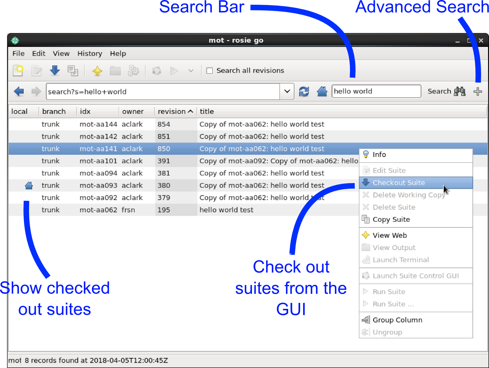

.. include:: ../../hyperlinks.rst
   :start-line: 1

.. _tutorial-rosie:

Rosie
=====

Rosie is a tool for managing Rose suite configurations which is included in
Rose. The purpose of Rosie is to facilitate suite development, management and
collaboration.
Rosie:

* Adds version control to Rose suite configurations.
* Updates a database to keep track of Rose suite configurations.

.. ifnotslides::

   .. warning::
      
      This tutorial does not require specific FCM knowledge but basic version
      control awareness is important. For more information on FCM version
      control see the `FCM User Guide`_.

Rosie Suites
------------

.. _working copy: http://svnbook.red-bean.com/en/1.7/svn.basic.in-action.html#svn.basic.in-action.wc

A Rosie suite is a Rose suite configuration which is managed by the Rosie
system.

.. ifnotslides::

   Rosie suites can be created by the command:

:ref:`command-rosie-create`
   Create a new suite or copy an existing one.

.. ifnotslides::

   By default Rosie creates the `working copy`_ (local copy) of new suites in
   the ``~/roses`` directory though Rosie working copies can be created
   elsewhere.

.. notslides::

   Working copy installed in ``~/roses``.

Version Control
---------------

In Rosie suites the :term:`suite directory` is added to `version control`_
using `FCM`_.

.. ifnotslides::

   FCM is a `subversion <SVN>`_ (SVN) wrapper which provides a standard working
   practice for SVN projects. FCM implements all of the SVN commands as well as
   additional functionality. See the `FCM User Guide`_ for more information.

Suite Naming
------------

.. ifnotslides::

   Each Rosie suite is assigned a unique name made up of a *prefix* followed by
   a hyphen and then an *identifier* made up of two characters and three
   numbers, e.g:

.. graph:: Example
   :align: center

   ranksep=0

   node [shape="plaintext", fontsize="11"]
   edge [style="invis"]

   a1 [label="u", fontsize=20]
   a2 [label="Prefix", fontcolor="#707070"]
   b1 [label="-", fontsize=20]
   b2 [label="", fontcolor="#707070"]
   c1 [label="aa001", fontsize=20]
   c2 [label="Unique Identifier", fontcolor="#707070"]

   a1 -- a2
   b1 -- b2
   c1 -- c2

.. ifnotslides::

   The prefix denotes the repository in which the suite is located. Prefixes are
   site specific and are configured by the
   :rose:conf:`rose.conf[rosie-id]prefix-location.PREFIX` setting.

   Within the Rose user community the ``u`` prefix is typically configured to
   point at the `SRS`_ repository.

.. ifslides::

   :rose:conf:`rose.conf[rosie-id]prefix-location.PREFIX`

   ``u`` = SRS

The :rose:file:`rose-suite.info` File
-------------------------------------

.. ifnotslides::

   All Rosie suites require a :rose:file:`rose-suite.info` file. This file
   provides information about the suite for use in the suite management and
   version control systems. The :rose:file:`rose-suite.info` file uses the
   :ref:`Rose Configuration Format <tutorial-rose-configurations>`.
   The main settings are:

``title``
   A short title for the suite.
``owner``
   The user who has control over the suite (i.e. their username).
``project``
   The project to which this suite belongs (can be an arbitrary name).
``access-list``
   An optional list of users who have permission to commit to the trunk of the
   suite.

Managing Suites
---------------

Rosie provides commands for managing suites, including:

:ref:`command-rosie-checkout`
   Creates a local copy of a suite.
:ref:`command-rosie-ls`
   Lists all locally checked-out suites.
:ref:`command-rosie-lookup`
   Searches the suite database (using information from suite's
   :rose:file:`rose-suite.info` files).

.. nextslide::

.. ifnotslides::

   Rosie also provides a GUI called :ref:`command-rosie-go` which incorporates
   the functionality of the above commands.

   Screenshot of the rosie go GUI.

.. TODO - migrate the old "Rose User Guide: Rosie Go" page?

.. nextslide::

.. ifslides::

   .. rubric:: In this practical we will add the
      :ref:`weather-forecasting suite <tutorial-datetime-cycling-practical>`
      from the :ref:`previous practical <suites-practical>` to a rosie
      repository, make some changes, and commit them to the repository.

   Next section: :ref:`tutorial-rose-summary`

.. practical::

   .. rubric:: In this practical we will add the
      :ref:`weather-forecasting suite <tutorial-datetime-cycling-practical>`
      from the :ref:`previous practical <suites-practical>` to a rosie
      repository, make some changes, and commit them to the repository.

   .. note::
      :class: tip

      For brevity this practical uses the abbreviated version of SVN commands,
      e.g. ``svn st`` is the abbreviated form of ``svn status``.
      FCM supports both the full and abbreviated names.

   #. **Create A New Rosie Suite.**

      First, create a blank Rosie suite in an appropriate repository.
      You will probably want to use a "testing" repository if one is available
      to you.

      You can specify the repository to use with the ``--prefix`` command-line
      option. For instance to use the (internal) Met Office Testing Repository
      supply the command line argument ``--prefix=mot``.

      .. code-block:: sub

         rosie create --prefix=<prefix>

      You will then be presented with a :rose:file:`rose-suite.info` file open
      in a text editor. For the ``title`` field type "Dummy Weather Forecasting
      Suite" and for the ``project`` enter "tutorial". Save the file and close
      the editor.

      .. tip::

         If the text editor does not appear you may have to press enter on the
         keyboard.

      Rosie will create the new suite in the ``~/roses`` directory and the
      exact location will appear in the command output. Move into the suite
      directory:

      .. code-block:: sub

         cd ~/roses/<suite>

   #. **Add Files To The Suite.**

      Add the files from the Weather Forecasting Suite by running::

         rose tutorial rose-weather-forecasting-suite .

      We now need to add these files to version control. First check the SVN
      status by running::

         fcm st

      You should see a list of files with the ``?`` symbol next to them,
      as well as :file:`rose-suite.conf` with an ``M`` symbol beside it. ``?``
      means the files marked are untracked (not version controlled), whereas
      ``M`` indicates files which have been modified. Add all untracked files
      to version control by running::

         fcm add --check .

      Answer yes ("y") where prompted. Now check the status again::

         fcm st

      You should see a list of files with the ``A`` character, meaning "added",
      next to them. Finally commit the changes by running::

         fcm ci

      A text editor will open. Add a message for your commit, save the file and
      close the editor. You will then be prompted as to whether you want to
      make the commit. Answer yes.

      You have now added the Weather Forecasting Suite to version control. Open
      the Trac browser to see your suite::

         fcm browse
      
      A web browser window will open, showing the Trac page for your Rosie
      suite.

      .. TODO - Note remove ?rev=xxxx to see latest revision?

   #. **Find The Suite In Rosie Go.**

      Open the :ref:`command-rosie-go` GUI::

         rosie go &

      Open the advanced search options by clicking the add (:guilabel:`+`)
      button in the top right-hand corner of the window.

      Search for suites which you have authored by selecting :guilabel:`author`
      and filling in your username in the right-hand box:

      .. image:: img/rosie-go-author-search.png
         :align: center
         :alt: rosie go advanced search for author screenshot

      Press :guilabel:`Search`. You should see your suite appear with a home
      icon next to it, meaning that you have a local copy checked out.

      Right-click on the suite and then click :guilabel:`Info`. You should
      see the information defined in the :rose:file:`rose-suite.info` file.

      .. admonition:: Help
         :class: tip

         If your suite does not show up, select the menu item
         :menuselection:`Edit --> Data Source` and ensure the repository you
         committed to is checked.

   #. **Checkout The Suite.**

      Now that the suite is in the Rosie repository a working copy can be
      checked out on any machine with access to the repository by executing:

      .. code-block:: sub

         rosie checkout <suite>

      Test this by deleting the working copy then checking out a new one:

      .. code-block:: sub

         cd ~/roses
         rm -rf <suite>
         rosie checkout <suite>

.. TODO - introduce practical extension / mention what useful for (or similar).

.. practical-extension::

   #. **Make Changes In A Branch.**

      Next we will make a change to the suite. Rather than making this change
      in the "trunk" (referred to as "master" in git terminology) we will
      work in a new "branch".

      Create a new branch called "configuration-change" by running::

         fcm bc configuration-change

      Provide a brief commit message of your choosing when prompted and enter
      yes ("y").

      You can list all branches by running::

         fcm bls

      Switch to your new branch::

         fcm sw configuration-change

      Next, either using the :ref:`command-rose-config-edit` GUI or a text
      editor, change the ``RESOLUTION`` setting in the
      :rose:file:`rose-suite.conf` file to ``0.1``.

      Check the status of the project::

         fcm st

      You should see the :rose:file:`rose-suite.conf` file with a ``M``,
      meaning modified, next to it. Commit the change by running::

         fcm ci

      Again you will need to provide a commit message and answer yes to the
      prompt.

   #. **Merge The Branch.**

      Switch back to the trunk then merge your change branch into the trunk::

         fcm sw trunk
         fcm merge configuration-change

      Check the status (you should see the ``M`` symbol next to the
      :rose:file:`rose-suite.conf` file) then commit the merge::

         fcm st
         fcm ci
