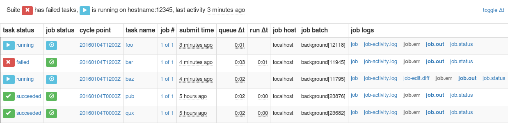

.. include:: ../../hyperlinks.rst
   :start-line: 1

.. _tutorial-rose-suites:

Rose Suite Configurations
=========================

:term:`Rose application configurations <Rose application configuration>`
can be used to encapsulate the environment and resources required by a Cylc
:term:`task`.

Similarly :term:`Rose suite configurations <Rose suite configuration>` can
be used to do the same for a :term:`Cylc suite`.

Configuration Format
--------------------

A Rose suite configuration is a Cylc :term:`suite directory` containing a
:rose:file:`rose-suite.conf` file.

.. NOTE - The rose-suite.info is not mentioned here as it is really a rosie
          feature.

.. ifnotslides::

   The :rose:file:`rose-suite.conf` file is written in the same
   :ref:`format <tutorial-rose-configurations>` as the
   :rose:file:`rose-app.conf` file. Its main configuration sections are:

   :rose:conf:`rose-suite.conf[env]`
      Environment variables for use by the whole suite.
   :rose:conf:`rose-suite.conf[jinja2:suite.rc]`
      `Jinja2`_ variables for use in the ``suite.rc`` file.
   :rose:conf:`rose-suite.conf[file:NAME]`
      Files and resources to be installed in the :term:`run directory` when the
      suite is run.

.. ifslides::

   * :rose:conf:`rose-suite.conf[env]`
   * :rose:conf:`rose-suite.conf[jinja2:suite.rc]`
   * :rose:conf:`rose-suite.conf[file:NAME]`

.. nextslide::

.. ifnotslides::

   In the following example the environment variable ``GREETING`` and the
   Jinja2 variable ``WORLD`` are both set in the :rose:file:`rose-suite.conf`
   file. These variables can then be used in the ``suite.rc`` file:

.. code-block:: rose
   :caption: rose-suite.conf

   [env]
   GREETING=Hello

   [jinja2:suite.rc]
   WORLD=Earth

.. code-block:: cylc
   :caption: suite.rc

   [scheduling]
       [[dependencies]]
           graph = hello_{{WORLD}}

   [runtime]
       [[hello_{{WORLD}}]]
           script = echo "$GREETING {{WORLD}}"

.. _Suite Directory Vs Run Directory:

Suite Directory Vs Run Directory
--------------------------------

:term:`suite directory`
   The directory in which the suite is written. The ``suite.rc`` and
   :rose:file:`rose-suite.conf` files live here.
:term:`run directory`
   The directory in which the suite runs. The ``work``, ``share`` and ``log``
   directories live here.

.. ifnotslides::

   Throughout the :ref:`Cylc Tutorial` we wrote suites in the ``cylc-run``
   directory. As Cylc runs suites in the ``cylc-run`` directory the
   :term:`suite directory` is also the :term:`run directory` i.e. the suite runs
   in the same directory in which it is written.

   With Rose we develop suites in a separate directory to the one in which they
   run meaning that the :term:`suite directory` is different from the
   :term:`run directory`. This helps keep the suite separate from its output and
   means that you can safely work on a suite and its resources whilst it is
   running.

.. nextslide::

.. ifslides::

   Cylc
      * :term:`suite directory` = ``~/cylc-run/<suite>``
      * :term:`run directory` = ``~/cylc-run/<suite>``
   Rose
      * :term:`suite directory` = ``/path/to/<suite>``
      * :term:`run directory` = ``~/cylc-run/<suite>``

.. note::

   Using Cylc it is possible to separate the :term:`suite directory` and
   :term:`run directory` using the ``cylc register`` command. Note though
   that suite resources, e.g. scripts in the ``bin/`` directory, will remain
   in the :term:`suite directory` so cannot safely be edited whilst the suite
   is running.

Running Rose Suite Configurations
---------------------------------

.. ifnotslides::

   Rose :ref:`Application Configurations <Application Configuration>` are
   run using :ref:`command-rose-app-run`, Rose Suite Configurations are
   run using :ref:`command-rose-suite-run`.

   When a suite configuration is run:

.. _rose-suite-run-stages:

#. The :term:`suite directory` is copied into the ``cylc-run`` directory where
   it becomes the :term:`run directory`.
#. Any files defined in the :rose:file:`rose-suite.conf` file are installed.
#. Jinja2 variables defined in the :rose:file:`rose-suite.conf` file are added
   to the top of the ``suite.rc`` file.
#. The Cylc suite is validated.
#. The Cylc suite is run.
#. The Cylc GUI is launched.

.. nextslide::

.. _rose-suite-installation-diagram:

.. digraph:: Example
   :align: center

    graph [rankdir="LR"]
    node [shape="none"]
    edge [color="blue"]

    size="7,5"
    ranksep=0.75

    subgraph cluster_suite_directory {
        label="Suite Directory"
        fontsize=17
        fontname="sanz bold"
        style="dashed"
        suite_rc_suite_dir [label="suite.rc"]
        rose_suite_conf_suite_dir [label="rose-suite.conf"]
        bin_suite_dir [label="bin/"]
    }

    subgraph cluster_run_directory {
        label="Run Directory"
        fontsize=17
        fontname="sanz bold"
        style="dashed"
        suite_rc_run_dir [label="suite.rc"]
        rose_suite_conf_run_dir [label="rose-suite.conf"]
        files_run_dir [label="installed files"]
        bin_run_dir [label="bin/"]
        work [label="work/"]
        share [label="share/"]
        log [label="log/"]
    }

    jinja2 [label="Prepend Jinja2",
            shape="box",
            fontcolor="blue",
            color="blue"]
    install_files [label="Install Files",
                   shape="box",
                   fontcolor="blue",
                   color="blue"]

    suite_rc_suite_dir -> jinja2 -> suite_rc_run_dir
    rose_suite_conf_suite_dir -> jinja2 [style="dashed", arrowhead="empty"]
    rose_suite_conf_suite_dir -> rose_suite_conf_run_dir
    rose_suite_conf_suite_dir -> install_files [style="dashed",
                                                arrowhead="empty"]
    install_files -> files_run_dir
    bin_suite_dir -> bin_run_dir

.. nextslide::

.. ifnotslides::

   Like :ref:`command-rose-app-run`, :ref:`command-rose-suite-run` will look
   for a configuration to run in the current directory. The command can be run
   from other locations using the ``-C`` argument::

      rose suite-run -C /path/to/suite/configuration/

   The ``--local-install-only`` command line option will cause the suite
   to be installed (though only on your local machine, not on any job hosts) and
   validated but not run (i.e. :ref:`steps 1-4 <rose-suite-run-stages>`).

.. ifslides::

   .. code-block:: bash

      rose suite-run
      rose suite-run -C /path/to/suite/configuration/
      rose suite-run --local-install-only

Start, Stop, Restart
--------------------

.. ifnotslides::

   Under Rose, suites will run using the name of the suite directory. For
   instance if you run :ref:`command-rose-suite-run` on a suite in the directory
   ``~/foo/bar`` then it will run with the name ``bar``.

   The name can be overridden using the ``--name`` option i.e:

.. code-block:: sub

   rose suite-run --name <SUITE_NAME>

.. ifnotslides::

   :ref:`Starting Suites`
      Suites must be run using the :ref:`command-rose-suite-run` command which
      in turn calls the ``cylc run`` command.
   :ref:`Stopping Suites`
      Suites can be stopped using the ``cylc stop <SUITE_NAME>`` command,
      as for regular Cylc suites.
   :ref:`Restarting Suites`
      There are two options for restarting:

      * To pick up where the suite left off use
        :ref:`command-rose-suite-restart`.
        No changes will be made to the run directory. *This is usually the
        recommended option.*
      * To restart in a way that picks up changes made in the suite directory,
        use the ``--restart`` option to the :ref:`command-rose-suite-run`
        command.

.. ifslides::

   Starting Suites
      ``rose suite-run`` which in turn calls ``cylc run``
   Stopping Suites
      ``cylc stop <SUITE_NAME>``
   Restarting Suites
      * ``rose suite-restart`` (just restart)
      * ``rose suite-run --restart`` (re-install and restart)

See the :ref:`Cheat Sheet` for more information.

.. note::

   :ref:`command-rose-suite-run` installs suites to the run directory
   incrementally so if you change a file and restart the suite using
   ``rose suite-run --restart`` only the changed file will be re-installed.
   This process is strictly constructive i.e. any files deleted in the suite
   directory will *not* be removed from the run directory. To force
   :ref:`command-rose-suite-run` to perform a complete rebuild, use the
   ``--new`` option.

.. nextslide::

.. ifslides::

   .. rubric:: In this tutorial we will create a Rose Suite Configuration for
      the
      :ref:`weather-forecasting suite<tutorial-datetime-cycling-practical>`.

   Next Steps:

   * Read through the :ref:`Cheat Sheet`

.. _suites-practical:

.. practical::

   .. rubric:: In this tutorial we will create a Rose Suite Configuration for
      the
      :ref:`weather-forecasting suite<tutorial-datetime-cycling-practical>`.

   #. **Create A New Suite.**

      Create a copy of the :ref:`weather-forecasting suite
      <tutorial-cylc-runtime-forecasting-suite>` by running::

         rose tutorial rose-suite-tutorial ~/rose-tutorial/rose-suite-tutorial
         cd ~/rose-tutorial/rose-suite-tutorial

      Set the initial and final cycle points as in :ref:`previous tutorials
      <tutorial-cylc-runtime-tutorial-suite-initial-and-final-cyle-points>`.

   #. **Create A Rose Suite Configuration.**

      Create a blank :rose:file:`rose-suite.conf` file::

         touch rose-suite.conf

      You now have a Rose suite configuration. A :rose:file:`rose-suite.conf`
      file does not need to have anything in it but it is required to run
      :ref:`command-rose-suite-run`.

      There are three things defined in the ``suite.rc`` file which it might be
      useful to be able to configure:

      ``station``
         The list of weather stations to gather observations from.
      ``RESOLUTION``
         The spatial resolution of the forecast model.
      ``DOMAIN``
         The geographical limits of the model.

      Define these settings in the :rose:file:`rose-suite.conf` file by adding
      the following lines:

      .. code-block:: rose

         [jinja2:suite.rc]
         station="camborne", "heathrow", "shetland", "belmullet"

         [env]
         RESOLUTION=0.2
         DOMAIN=-12,48,5,61

      Note that `Jinja2`_ strings must be quoted.

   #. **Write Suite Metadata.**

      Create a ``meta/rose-meta.conf`` file and write some metadata for the
      settings defined in the :rose:file:`rose-suite.conf` file.

      * ``station`` is a list of unlimited length.
      * ``RESOLUTION`` is a "real" number.
      * ``DOMAIN`` is a list of four integers.

      .. tip::

         For the ``RESOLUTION`` and ``DOMAIN`` settings you can copy the
         metadata you wrote in the :ref:`Metadata Tutorial
         <tutorial-rose-metadata>`.

      .. spoiler:: Solution warning

         .. code-block:: rose

            [jinja2:suite.rc=station]
            length=:

            [env=RESOLUTION]
            type=real

            [env=DOMAIN]
            length=4
            type=integer

      Validate the metadata::

         rose metadata-check -C meta/

      Open the :ref:`command-rose-config-edit` GUI. You should see
      :guilabel:`suite conf` in the panel on the left-hand side of the window.
      This will contain the environment and Jinja2 variables we have just
      defined.

   #. **Use Suite Variables In The** ``suite.rc`` **File.**

      Next we need to make use of these settings in the ``suite.rc`` file.

      We can delete the ``RESOLUTION`` and ``DOMAIN`` settings in the
      ``[runtime][root][environment]`` section which would otherwise override
      the variables we have just defined in the :rose:file:`rose-suite.conf`
      file, like so:

      .. code-block:: diff

          [runtime]
              [[root]]
                  # These environment variables will be available to all tasks.
                  [[[environment]]]
                      # Add the `python` directory to the PYTHONPATH.
                      PYTHONPATH="$CYLC_SUITE_RUN_DIR/lib/python:$PYTHONPATH"
         -            # The dimensions of each grid cell in degrees.
         -            RESOLUTION = 0.2
         -            # The area to generate forecasts for (lng1, lat1, lng2, lat2).
         -            DOMAIN = -12,48,5,61  # Do not change!

      We can write out the list of stations, using the `Jinja2`_ ``join``
      filter to write the commas between the list items:

      .. code-block:: diff

          [cylc]
              UTC mode = True
              [[parameters]]
                  # A list of the weather stations we will be fetching observations from.
         -        station = camborne, heathrow, shetland, belmullet
         +        station = {{ station | join(", ") }}
                  # A list of the sites we will be generating forecasts for.
                  site = exeter

   #. **Install The Suite.**

      Running :ref:`command-rose-suite-run` will cause the suite to be
      installed, validated and run.

      Use the ``--local-install-only`` command-line option to install the
      suite on your local machine and validate it::

         rose suite-run --local-install-only

      Inspect the installed suite, which you will find in
      the :term:`run directory`, i.e::

         ~/cylc-run/rose-suite-tutorial

      You should find all the files contained in the :term:`suite directory`
      as well as the :term:`run directory` folders ``log``, ``work`` and
      ``share``.

Rose Applications In Rose Suite Configurations
----------------------------------------------

.. ifnotslides::

   In Cylc suites, Rose applications are placed in an ``app/`` directory which
   is copied across to the :term:`run directory` with the rest of the suite by
   :ref:`command-rose-suite-run` when the suite configuration is run.

   When we run Rose applications from within Cylc suites we use the
   :ref:`command-rose-task-run` command rather than the
   :ref:`command-rose-app-run` command.

   When run, :ref:`command-rose-task-run` searches for an application with the
   same name as the Cylc task in the ``app/`` directory.

   The :ref:`command-rose-task-run` command also interfaces with Cylc to provide
   a few useful environment variables (see the
   :ref:`command-line reference <command-rose-task-run>` for details). The
   application will run in the :term:`work directory`, just like for a
   regular Cylc task.

   In this example the ``hello`` task will run the application located in
   ``app/hello/``:

.. ifslides::

   * :ref:`command-rose-app-run` - run an application standalone.
   * :ref:`command-rose-task-run` - run an application from a cylc task.

   The ``app/`` directory
     * Installed by :ref:`command-rose-suite-run`.
     * :ref:`command-rose-task-run` searches for applications here.

   :ref:`command-rose-task-run` runs applications in :term:`work directory`
   the same as for a cylc :term:`task`.

.. nextslide::

.. code-block:: cylc
   :caption: suite.rc

   [runtime]
       [[hello]]
           script = rose task-run

.. code-block:: rose
   :caption: app/hello/rose-app.conf

   [command]
   default=echo "Hello World!"

.. nextslide::

.. ifnotslides::

   The name of the application to run can be overridden using the ``--app-key``
   command-line option or the :envvar:`ROSE_TASK_APP` environment variable. For
   example the ``greetings`` :term:`task` will run the ``hello``
   :term:`app <Rose app>` in the task defined below.

.. code-block:: cylc
   :caption: suite.rc

   [runtime]
       [[greetings]]
           script = rose task-run --app-key hello

.. ifslides::

   Or alternatively using :envvar:`ROSE_TASK_APP`.

Rose Bush
---------

.. TODO - move this into the Cylc tutorial with the upcomming Cylc "nameless".

.. ifnotslides::

   Rose provides a utility for viewing the status and logs of Cylc suites called
   Rose Bush. Rose Bush displays suite information in web pages.

   Screenshot of a Rose Bush web page.

.. ifnotslides::

   If a Rose Bush server is provided at your site, you can open the Rose Bush
   page for a suite by running the :ref:`command-rose-suite-log` command
   in the suite directory.

   Otherwise an add-hoc web server can be set up using the
   :ref:`command-rose-bush` ``start`` command argument.

.. ifslides::

   * :ref:`command-rose-suite-log`
   * :ref:`command-rose-bush` ``start``

   .. nextslide::

   .. rubric:: In this practical we will take the ``forecast`` Rose application
      that we developed in the :ref:`Metadata Tutorial <tutorial-rose-metadata>`
      and integrate it into the :ref:`weather-forecasting suite
      <tutorial-datetime-cycling-practical>`.

   Next section: :ref:`tutorial-rosie`

.. practical::

   .. rubric:: In this practical we will take the ``forecast`` Rose application
      that we developed in the :ref:`Metadata Tutorial <tutorial-rose-metadata>`
      and integrate it into the :ref:`weather-forecasting suite
      <tutorial-datetime-cycling-practical>`.

   Move into the suite directory from the previous practical::

      cd ~/rose-tutorial/rose-suite-tutorial

   You will find a copy of the ``forecast`` application located in
   ``app/forecast``.

   #. **Create A Test Configuration For The** ``forecast`` **Application.**

      We have configured the ``forecast`` application to use test data. We will
      now adjust this configuration to make it work with real data generated by
      the Cylc suite. It is useful to keep the ability to run the application
      using test data, so we won't delete this configuration. Instead we
      will move it into an :ref:`Optional Configuration` so that we can run
      the application in "test mode" or "live mode".

      Optional configurations are covered in more detail in the
      :ref:`Optional Configurations
      Tutorial <rose-tutorial-optional-configurations>`. For now all we need to
      know is that they enable us to store alternative configurations.

      Create an optional configuration called ``test`` inside the ``forecast``
      application::

         mkdir app/forecast/opt
         touch app/forecast/opt/rose-app-test.conf

      This optional configuration is a regular Rose configuration file. Its
      settings will override those in the :rose:file:`rose-app.conf` file if
      requested.

      .. tip::

         Take care not to confuse the ``rose-app.conf`` and
         ``rose-app-test.conf`` files used within this practical.

      Move the following environment variables from the
      ``app/forecast/rose-app.conf`` file into an ``[env]``
      section in the ``app/forecast/opt/rose-app-test.conf`` file:

      * ``WEIGHTING``
      * ``WIND_CYCLES``
      * ``WIND_FILE_TEMPLATE``
      * ``RAINFALL_FILE``
      * ``MAP_FILE``
      * ``CYLC_TASK_CYCLE_POINT``
      * ``RESOLUTION``
      * ``DOMAIN``

      .. spoiler:: Solution warning

         The ``rose-app-test.conf`` file should look like this:

         .. TODO - load this file from the tutorials directory

         .. code-block:: rose

            [env]
            WEIGHTING=1
            WIND_CYCLES=0
            WIND_FILE_TEMPLATE=test-data/wind_{cycle}_{xy}.csv
            RAINFALL_FILE=test-data/rainfall.csv
            MAP_FILE=map.html
            CYLC_TASK_CYCLE_POINT=20171101T0000Z
            RESOLUTION=0.2
            DOMAIN=-12,48,5,61

      Run the application in "test mode" by providing the option
      ``--opt-conf-key=test`` to the :ref:`command-rose-app-run` command::

         mkdir app/forecast/run
         cd app/forecast/run
         rose app-run --opt-conf-key=test -C ../
         cd ../../../

      You should see the stdout output of the Rose application. If there are
      any errors they will be marked with the ``[FAIL]`` prefix.

   #. **Integrate The** ``forecast`` **Application Into The Suite.**

      We can now configure the ``forecast`` application to work with real data.

      We have moved the map template file (``map-template.html``) into the
      ``forecast`` application so we can delete the ``MAP_TEMPLATE``
      environment variable from the ``[runtime]forecast`` section of the
      ``suite.rc`` file.

      Copy the remaining environment variables defined in the ``forecast``
      task within the ``suite.rc`` file into the :rose:file:`rose-app.conf`
      file of the ``forecast`` application, replacing any values already
      specified if necessary. Remove the lines from the ``suite.rc`` file
      when you are done.

      .. TODO - remove triple quotes in Cylc tutorial

      Remember, in Rose configuration files:

      * Spaces are not used around the equals (``=``) operator.
      * Environment variables should not be quoted.

      .. TODO -- what what, point this out earlier!

      The ``[env]`` section of your :rose:file:`rose-app.conf` file should now
      look like this:

      .. code-block:: rose

         [env]
         INTERVAL=60
         N_FORECASTS=5
         WEIGHTING=1
         MAP_TEMPLATE=map-template.html
         SPLINE_LEVEL=0
         WIND_FILE_TEMPLATE=$CYLC_SUITE_WORK_DIR/{cycle}/consolidate_observations/wind_{xy}.csv
         WIND_CYCLES=0, -3, -6
         RAINFALL_FILE=$CYLC_SUITE_WORK_DIR/$CYLC_TASK_CYCLE_POINT/get_rainfall/rainfall.csv
         MAP_FILE=${CYLC_TASK_LOG_ROOT}-map.html

      Finally we need to change the ``forecast`` task to run
      :ref:`command-rose-task-run`. The ``[runtime]forecast`` section of the
      ``suite.rc`` file should now look like this:

      .. code-block:: cylc

         [[forecast]]
             script = rose task-run

   #. **Make Changes To The Configuration.**

      Open the :ref:`command-rose-config-edit` GUI and navigate to the
      :guilabel:`suite conf > env` panel.

      Change the ``RESOLUTION`` variable to ``0.1``

      Navigate to the :guilabel:`forecast > env` panel.

      Edit the ``WEIGHTING`` variable so that it is equal to the following
      list of values::

         0.7, 0.2, 0.1

      .. tip::

         Click the "Add array element" button (:guilabel:`+`) to extend the
         number of elements assigned to ``WEIGHTING``.

      Finally, save these settings via :guilabel:`File > Save` in the menu.

   #. **Run The Suite.**

      Install, validate and run the suite::

         rose suite-run

      The ``cylc gui`` should open and the suite should run and complete.

   #. **View Output In Rose Bush.**

      Open the Rose Bush page in a browser by running the following command
      from within the suite directory::

         rose suite-log

      On this page you will see the tasks run by the suite, ordered from most
      to least recent. Near the top you should see an entry for the
      ``forecast`` task. On the right-hand side of the screen click
      :guilabel:`job-map.html`.
      
      As this file has a ``.html`` extension Rose Bush will render it.
      The raw text would be displayed otherwise.
